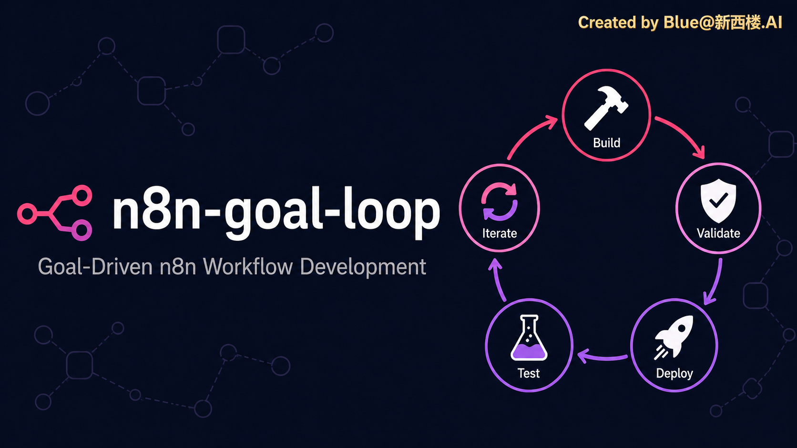

## n8n-goal-loop

__把 n8n 工作流需求转成可直接复制的 /goal，驱动 Agent 跑完整「构建 → 验证 → 部署 → 分层测试 → 迭代」闭环的 Skill__

__想了解更多最新 AI 行业动态，AI+电商/广告的行业实践方法，人与 AI 如何协作共生的思考，请关注公众号：【新西楼】__


__九要素 goal | 四层访谈对齐 | 11个references知识库 | 6类踩坑预防__

__Created By Buluu@新西楼__

---

## 项目简介

n8n-goal-loop 是一款 n8n 工作流开发的 goal 生成 Skill。当你让 Agent 搭建 n8n 工作流时，常因需求没说清而烂尾、跑偏、改不完——这个 Skill 先通过 2-3 轮对齐访谈帮你想清楚工作流的目标、节点链路和交付结果，再产出一份九要素 /goal，驱动 Agent 全自动完成开发测试闭环。

Skill 本身**只生成 goal**，不搭建、不部署、不运行工作流。

__兼容性广泛__：基于 agent-skills 标准，可在任何支持 Skill 的 Agent 中使用：

- Claude Code
- Codex（原生支持 /goal 命令）
- Cursor / OpenClaw / Gemini CLI 等（skills.sh 生态）

---

## 核心特性

### 九要素 goal

在通用七要素（目标/验证/约束/边界/迭代/完成/暂停）基础上，为 n8n 补两个最容易出问题的要素：

- **数据流契约** — 节点间字段映射、关键输入输出字段、数据格式
- **错误处理** — 关键节点失败时的兜底/降级策略

### 四层访谈对齐

n8n 工作流复杂，必须先对齐再生成（不默认一次性出 goal）：

1. 目标与交付
2. 节点链路（输入 → 处理 → 输出）
3. 具体服务确认（表格服务 / AI 模型 / 接入方式）
4. 红线（不能碰什么）

### 11 个 references 知识库

九要素详解、访谈框架、6类高频踩坑、设计规范、代码片段、运维规范、分层测试方法论、n8n-skills 最佳实践、环境管理——生成 goal 时自动参考，把踩过的坑预编进约束和迭代策略。

### 6 类踩坑预防

节点参数版本 / 数据流与引用 / Code 节点沙箱 / jsonBody 与表达式 / 凭证与 API / 实例与部署。

---

## 快速开始

### 前置要求

- 已安装 Claude Code / Codex / Cursor 等支持 Skill 的 Agent

### 安装

```bash
# Codex / Cursor / OpenClaw 等（skills.sh 生态）
npx skills add buluslan/n8n-goal-loop

# Claude Code
git clone https://github.com/buluslan/n8n-goal-loop.git ~/.claude/skills/n8n-goal-loop
```

### 使用

在 Agent 里说一句 n8n 需求，Skill 会先访谈对齐，再产出九要素 /goal：

```
帮我搭个 n8n 工作流，每天抓几个产品的评论，AI 分类统计差评原因
```

Agent 会先问你四层（目标 / 节点链路 / 具体服务 / 红线），然后给出可直接复制的九要素 /goal，覆盖数据流、错误处理、分层验证等。

---

## 项目结构

```
n8n-goal-loop/
├── SKILL.md                        # Skill 入口（访谈动线 + 九要素）
├── README.md
├── LICENSE                         # MIT
├── manifest.json
├── agents/interface.yaml           # 跨 agent 兼容声明
├── references/                     # 11 个知识库
│   ├── n8n-9-elements.md           # 九要素详解
│   ├── goal-command-playbook.md    # 模板 + 示例 + 反模式
│   ├── interview-checklist.md      # 四层访谈
│   ├── default-goal-strategy.md    # 访谈优先 + 风险分类
│   ├── n8n-pitfalls.md             # 6 类踩坑
│   ├── n8n-design-patterns.md      # 设计规范
│   ├── n8n-code-snippets.md        # 代码片段
│   ├── n8n-ops.md                  # 运维（SQLite/PG/检查清单）
│   ├── test-strategy.md            # 分层测试方法论
│   ├── n8n-best-practices.md       # 摘自 n8n-skills
│   └── env-context.md              # 摘自 n8n-as-code
├── scripts/
│   └── lint_goal_command.py        # 九要素检查 + n8n 危险词
└── assets/
    ├── banner.png
    └── qrcode.jpg
```

## 工作原理

```
用户说一句 n8n 需求
    → 四层访谈对齐（目标 / 节点链路 / 具体服务 / 红线）
    → 生成九要素 /goal（数据流、错误处理、约束等自动填）
    → lint 把关（九要素齐全、无方括号占位符、无危险词）
    → Agent 按 /goal 跑闭环（构建 → 验证 → 部署 → 测试 → 迭代）
```

## Credits

- Forked from [qiaomu-goal-meta-skill](https://github.com/joeseesun)（向阳乔木）— goal 契约结构与访谈优先理念
- 开发最佳实践参考 [n8n-skills](https://github.com/czlonkowski/n8n-skills)、[n8n-as-code](https://github.com/EtienneLescot/n8n-as-code)

## 许可证

MIT License - 详见 [LICENSE](LICENSE) 文件

## 联系方式

__Buluu@新西楼__

- 公众号：新西楼 — AI+电商/广告行业实践，人与 AI 协作思考
- GitHub Issues：https://github.com/buluslan/n8n-goal-loop/issues

---

如果这个项目对您有帮助，请给一个 ⭐️
